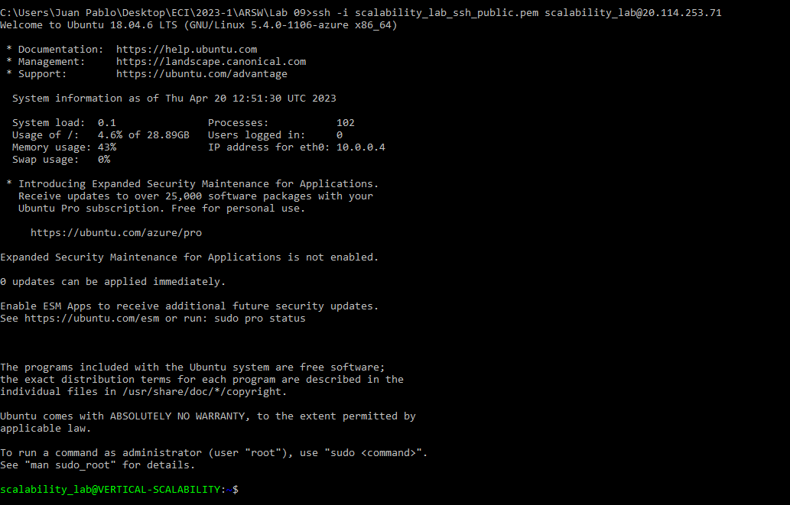
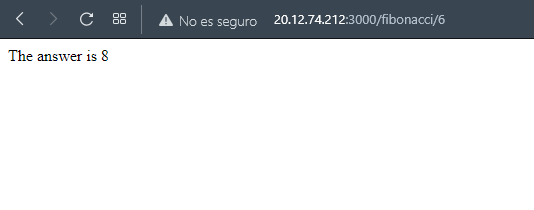
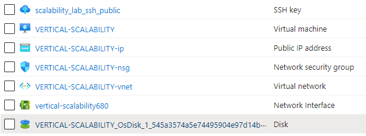
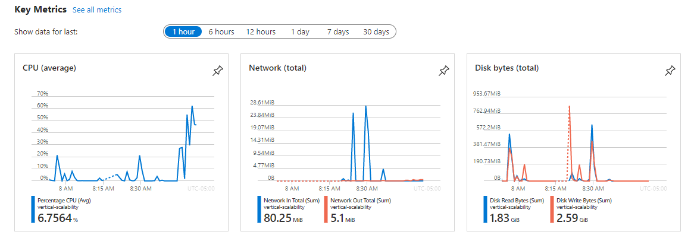
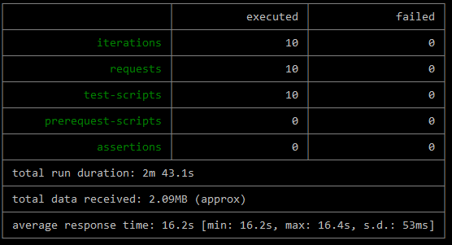
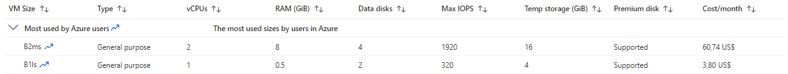
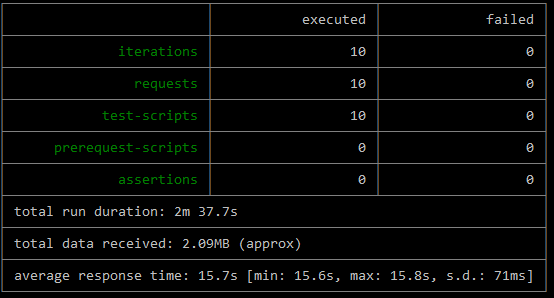
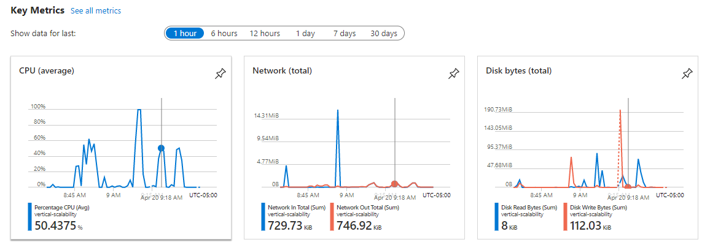
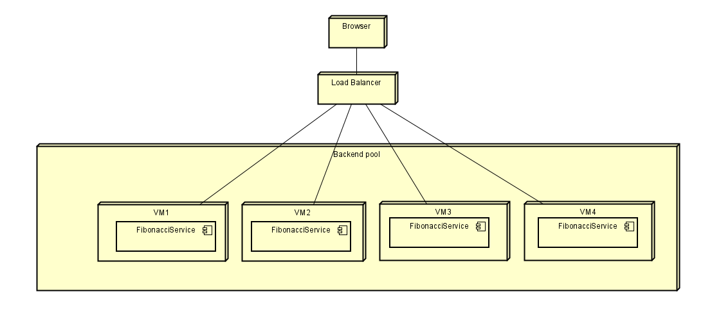

### Escuela Colombiana de Ingeniería
### Arquitecturas de Software - ARSW

## Escalamiento en Azure con Maquinas Virtuales, Sacale Sets y Service Plans

### Dependencias
* Cree una cuenta gratuita dentro de Azure. Para hacerlo puede guiarse de esta [documentación](https://azure.microsoft.com/es-es/free/students/). Al hacerlo usted contará con $100 USD para gastar durante 12 meses.

### Parte 0 - Entendiendo el escenario de calidad

Adjunto a este laboratorio usted podrá encontrar una aplicación totalmente desarrollada que tiene como objetivo calcular el enésimo valor de la secuencia de Fibonnaci.

**Escalabilidad**
Cuando un conjunto de usuarios consulta un enésimo número (superior a 1000000) de la secuencia de Fibonacci de forma concurrente y el sistema se encuentra bajo condiciones normales de operación, todas las peticiones deben ser respondidas y el consumo de CPU del sistema no puede superar el 70%.

### Parte 1 - Escalabilidad vertical

1. Diríjase al [Portal de Azure](https://portal.azure.com/) y a continuación cree una maquina virtual con las características básicas descritas en la imágen 1 y que corresponden a las siguientes:
    * Resource Group = SCALABILITY_LAB
    * Virtual machine name = VERTICAL-SCALABILITY
    * Image = Ubuntu Server 
    * Size = Standard B1ls
    * Username = scalability_lab
    * SSH publi key = Su llave ssh publica


2. Para conectarse a la VM use el siguiente comando, donde las `x` las debe remplazar por la IP de su propia VM (Revise la sección "Connect" de la virtual machine creada para tener una guía más detallada).

    `ssh scalability_lab@xxx.xxx.xxx.xxx`

   

3. Instale node, para ello siga la sección *Installing Node.js and npm using NVM* que encontrará en este [enlace](https://linuxize.com/post/how-to-install-node-js-on-ubuntu-18.04/).
4. Para instalar la aplicación adjunta al Laboratorio, suba la carpeta `FibonacciApp` a un repositorio al cual tenga acceso y ejecute estos comandos dentro de la VM:

    `git clone <your_repo>`

    `cd <your_repo>/FibonacciApp`

    `npm install`

5. Para ejecutar la aplicación puede usar el comando `npm FibinacciApp.js`, sin embargo una vez pierda la conexión ssh la aplicación dejará de funcionar. Para evitar ese compartamiento usaremos *forever*. Ejecute los siguientes comando dentro de la VM.

    ` node FibonacciApp.js`

6. Antes de verificar si el endpoint funciona, en Azure vaya a la sección de *Networking* y cree una *Inbound port rule* tal como se muestra en la imágen. Para verificar que la aplicación funciona, use un browser y user el endpoint `http://xxx.xxx.xxx.xxx:3000/fibonacci/6`. La respuesta debe ser `The answer is 8`.

   

   

7. La función que calcula en enésimo número de la secuencia de Fibonacci está muy mal construido y consume bastante CPU para obtener la respuesta. Usando la consola del Browser documente los tiempos de respuesta para dicho endpoint usando los siguintes valores:
    * 1000000
    * 1010000
    * 1020000
    * 1030000
    * 1040000
    * 1050000
    * 1060000
    * 1070000
    * 1080000
    * 1090000    

8. Dírijase ahora a Azure y verifique el consumo de CPU para la VM. (Los resultados pueden tardar 5 minutos en aparecer).


9. Ahora usaremos Postman para simular una carga concurrente a nuestro sistema. Siga estos pasos.
    * Instale newman con el comando `npm install newman -g`. Para conocer más de Newman consulte el siguiente [enlace](https://learning.getpostman.com/docs/postman/collection-runs/command-line-integration-with-newman/).
    * Diríjase hasta la ruta `FibonacciApp/postman` en una maquina diferente a la VM.
    * Para el archivo `[ARSW_LOAD-BALANCING_AZURE].postman_environment.json` cambie el valor del parámetro `VM1` para que coincida con la IP de su VM.
    * Ejecute el siguiente comando.

    ```
    newman run ARSW_LOAD-BALANCING_AZURE.postman_collection.json -e [ARSW_LOAD-BALANCING_AZURE].postman_environment.json -n 10 &
    newman run ARSW_LOAD-BALANCING_AZURE.postman_collection.json -e [ARSW_LOAD-BALANCING_AZURE].postman_environment.json -n 10
    ```

10. La cantidad de CPU consumida es bastante grande y un conjunto considerable de peticiones concurrentes pueden hacer fallar nuestro servicio. Para solucionarlo usaremos una estrategia de Escalamiento Vertical. En Azure diríjase a la sección *size* y a continuación seleccione el tamaño `B2ms`.


11. Una vez el cambio se vea reflejado, repita el paso 7, 8 y 9.
12. Evalue el escenario de calidad asociado al requerimiento no funcional de escalabilidad y concluya si usando este modelo de escalabilidad logramos cumplirlo.
13. Vuelva a dejar la VM en el tamaño inicial para evitar cobros adicionales.

**Preguntas**

1. ¿Cuántos y cuáles recursos crea Azure junto con la VM?

   Se generan tres recursos. Public IP Address, Resource Group, SSH key, Network Security Group, Virtual Network, Network Interface y Disk.

   

2. ¿Brevemente describa para qué sirve cada recurso?

   + **Public IP Address**: se utiliza para permitir que los recursos de Azure como un VM, sean accesibles desde internet.

   + **Resource Group**: es un contenedor lógico que se utiliza para organizar y administrar los recursos de Azure relacionados en una sola unidad.

   + **SSH Key**: una SSH key o clave SSH es un recurso que se utiliza para autenticar el acceso a una máquina virtual (VM) mediante el protocolo SSH (Secure Shell).
   
   + **Network Security Group**: un grupo de seguridad de red (network security group o NSG) es un recurso que se utiliza para filtrar el tráfico de red que ingresa o sale de una red virtual en Azure.
   
   + **Virtual Network**: una red virtual (virtual network o VNet) es un recurso que se utiliza para crear una red privada virtual en la nube de Azure.
   
   + **Network Interface**: una interfaz de red (Network Interface o NIC) es un recurso que se utiliza para conectar una máquina virtual (VM) a una red virtual en Azure.
   
   + **Disk**: un disco (Disk) es un recurso que se utiliza para almacenar los datos y el sistema operativo de una máquina virtual (VM).

3. ¿Al cerrar la conexión ssh con la VM, por qué se cae la aplicación que ejecutamos con el comando `npm FibonacciApp.js`? ¿Por qué debemos crear un *Inbound port rule* antes de acceder al servicio?

   Cuando se cierra la conexión SSH con una máquina virtual (VM) de forma abrupta, la sesión SSH se termina y todos los procesos que se ejecutaban en la sesión también se detienen. Se debe crear un Inbound port rule para poder acceder al recurso por el puerto 3000.

4. Adjunte tabla de tiempos e interprete por qué la función tarda tando tiempo.

   + 1000000 - 16s
   + 1010000 - 17.23s
   + 1020000 - 18.21s
   + 1030000 - 17.82s
   + 1040000 - 18.34s
   + 1050000 - 18.60s
   + 1060000 - 23.69s
   + 1070000 - 19.51s
   + 1080000 - 19.89s
   + 1090000 - 20.24s
   
   La función tarda mucho, ya que la función no está bien construida y la VM no tiene muchos recursos.

5. Adjunte imágen del consumo de CPU de la VM e interprete por qué la función consume esa cantidad de CPU.

   

   La función consume esta cantidad porque el tamaño de la VM es de 0.5 GiB de memoria.

6. Adjunte la imagen del resumen de la ejecución de Postman. Interprete:
    * Tiempos de ejecución de cada petición.
      
    * Si hubo fallos documentelos y explique.
      No hubo fallos.

7. ¿Cuál es la diferencia entre los tamaños `B2ms` y `B1ls` (no solo busque especificaciones de infraestructura)?

   

8. ¿Aumentar el tamaño de la VM es una buena solución en este escenario?, ¿Qué pasa con la FibonacciApp cuando cambiamos el tamaño de la VM?

   En este escenario no es buena solución aumentar el tamaño de la VM, ya que la función no está bien construida. El consumo de la CPU presenta mejoría, pero el tiempo de respuesta no varía significativamente.

   

   

9. ¿Qué pasa con la infraestructura cuando cambia el tamaño de la VM? ¿Qué efectos negativos implica?

   Al cambiar el tamaño de B1ls a B2ms, el impacto más significativo es el precio, ya que si el tamaño es B1ls el precio es de 3.80 US$ mientras que B2ms el precio es de 60.74 US$.
   
10. ¿Hubo mejora en el consumo de CPU o en los tiempos de respuesta? Si/No ¿Por qué?

   En el consumo de CPU si hubo una mejora porque la VM tiene más recursos, pero en tiempo de respuesta no porque la aplicación no es óptima.

11. Aumente la cantidad de ejecuciones paralelas del comando de postman a `4`. ¿El comportamiento del sistema es porcentualmente mejor?

### Parte 2 - Escalabilidad horizontal

#### Crear el Balanceador de Carga

Antes de continuar puede eliminar el grupo de recursos anterior para evitar gastos adicionales y realizar la actividad en un grupo de recursos totalmente limpio.

1. El Balanceador de Carga es un recurso fundamental para habilitar la escalabilidad horizontal de nuestro sistema, por eso en este paso cree un balanceador de carga dentro de Azure tal cual como se muestra en la imágen adjunta.


2. A continuación cree un *Backend Pool*, guiese con la siguiente imágen.


3. A continuación cree un *Health Probe*, guiese con la siguiente imágen.


4. A continuación cree un *Load Balancing Rule*, guiese con la siguiente imágen.


5. Cree una *Virtual Network* dentro del grupo de recursos, guiese con la siguiente imágen.


#### Crear las maquinas virtuales (Nodos)

Ahora vamos a crear 3 VMs (VM1, VM2 y VM3) con direcciones IP públicas standar en 3 diferentes zonas de disponibilidad. Después las agregaremos al balanceador de carga.

1. En la configuración básica de la VM guíese por la siguiente imágen. Es importante que se fije en la "Avaiability Zone", donde la VM1 será 1, la VM2 será 2 y la VM3 será 3.


2. En la configuración de networking, verifique que se ha seleccionado la *Virtual Network*  y la *Subnet* creadas anteriormente. Adicionalmente asigne una IP pública y no olvide habilitar la redundancia de zona.


3. Para el Network Security Group seleccione "avanzado" y realice la siguiente configuración. No olvide crear un *Inbound Rule*, en el cual habilite el tráfico por el puerto 3000. Cuando cree la VM2 y la VM3, no necesita volver a crear el *Network Security Group*, sino que puede seleccionar el anteriormente creado.


4. Ahora asignaremos esta VM a nuestro balanceador de carga, para ello siga la configuración de la siguiente imágen.


5. Finalmente debemos instalar la aplicación de Fibonacci en la VM. para ello puede ejecutar el conjunto de los siguientes comandos, cambiando el nombre de la VM por el correcto

```
git clone https://github.com/daprieto1/ARSW_LOAD-BALANCING_AZURE.git

curl -o- https://raw.githubusercontent.com/creationix/nvm/v0.34.0/install.sh | bash
source /home/vm1/.bashrc
nvm install node

cd ARSW_LOAD-BALANCING_AZURE/FibonacciApp
npm install

npm install forever -g
forever start FibonacciApp.js
```

Realice este proceso para las 3 VMs, por ahora lo haremos a mano una por una, sin embargo es importante que usted sepa que existen herramientas para aumatizar este proceso, entre ellas encontramos Azure Resource Manager, OsDisk Images, Terraform con Vagrant y Paker, Puppet, Ansible entre otras.

#### Probar el resultado final de nuestra infraestructura

1. Porsupuesto el endpoint de acceso a nuestro sistema será la IP pública del balanceador de carga, primero verifiquemos que los servicios básicos están funcionando, consuma los siguientes recursos:

```
http://52.155.223.248/
http://52.155.223.248/fibonacci/1
```

2. Realice las pruebas de carga con `newman` que se realizaron en la parte 1 y haga un informe comparativo donde contraste: tiempos de respuesta, cantidad de peticiones respondidas con éxito, costos de las 2 infraestrucruras, es decir, la que desarrollamos con balanceo de carga horizontal y la que se hizo con una maquina virtual escalada.

3. Agregue una 4 maquina virtual y realice las pruebas de newman, pero esta vez no lance 2 peticiones en paralelo, sino que incrementelo a 4. Haga un informe donde presente el comportamiento de la CPU de las 4 VM y explique porque la tasa de éxito de las peticiones aumento con este estilo de escalabilidad.

```
newman run ARSW_LOAD-BALANCING_AZURE.postman_collection.json -e [ARSW_LOAD-BALANCING_AZURE].postman_environment.json -n 10 &
newman run ARSW_LOAD-BALANCING_AZURE.postman_collection.json -e [ARSW_LOAD-BALANCING_AZURE].postman_environment.json -n 10 &
newman run ARSW_LOAD-BALANCING_AZURE.postman_collection.json -e [ARSW_LOAD-BALANCING_AZURE].postman_environment.json -n 10 &
newman run ARSW_LOAD-BALANCING_AZURE.postman_collection.json -e [ARSW_LOAD-BALANCING_AZURE].postman_environment.json -n 10
```

**Preguntas**

* ¿Cuáles son los tipos de balanceadores de carga en Azure y en qué se diferencian?

Existen tres tipos de balanceadores de carga, que se diferencian en función de la capa de red en la que operan:

Balanceador de carga de nivel de aplicación (Application Gateway):

Este tipo de balanceador opera en la capa 7 (capa de aplicación) del modelo OSI, y permite enrutar el tráfico basado en datos específicos de la aplicación, como la URL o el encabezado HTTP. Además, proporciona funcionalidades avanzadas de seguridad, como el cifrado SSL y la protección contra ataques DDoS.

Balanceador de carga de tráfico de red (Load Balancer):

Este tipo de balanceador opera en la capa 4 (capa de transporte) del modelo OSI, y se utiliza para distribuir el tráfico entrante de manera uniforme entre los servidores de back-end. Puede equilibrar la carga en función de las reglas de equilibrio de carga de IP, puerto y protocolo.

Gateway VPN (Virtual Private Network):
Este tipo de balanceador se utiliza para conectar una red virtual de Azure a una red local a través de una conexión VPN segura. Puede ser configurado para enrutar el tráfico de entrada y salida entre la red virtual y la red local, lo que permite la integración de servicios en la nube y en las instalaciones.

En resumen, el balanceador de carga de nivel de aplicación (Application Gateway) se enfoca en enrutar el tráfico basado en datos específicos de la aplicación, mientras que el balanceador de carga de tráfico de red (Load Balancer) se enfoca en la distribución uniforme del tráfico entre los servidores de back-end. El Gateway VPN se enfoca en proporcionar conectividad segura y de alta velocidad entre redes virtuales de Azure y redes locales.

* ¿Qué es SKU, qué tipos hay y en qué se diferencian?

El SKU (Stock Keeping Unit) es un identificador único asignado a un recurso para indicar sus características, capacidades y precios. Los diferentes SKU permiten a los usuarios seleccionar la opción que mejor se adapte a sus necesidades, y pueden variar en términos de capacidad, escalabilidad, rendimiento y disponibilidad.
Los SKU están disponibles para una amplia variedad de recursos en Azure, incluidos máquinas virtuales, bases de datos, almacenamiento, servicios de red y otros servicios en la nube.
1.	SKU de máquina virtual (Virtual Machine SKU): Este tipo de SKU define las características y capacidades de una instancia de máquina virtual, como el número de núcleos de CPU, la cantidad de RAM, la capacidad de almacenamiento y el rendimiento de la red. Los SKU de máquina virtual están disponibles en diferentes categorías, como de uso general, optimizados para cómputo, memoria y almacenamiento.
2.	SKU de base de datos (Database SKU): Este tipo de SKU define las características y capacidades de una base de datos en Azure, como el tamaño de almacenamiento, el rendimiento y la disponibilidad. Los SKU de base de datos están disponibles en diferentes categorías, como de uso general, optimizados para memoria y de alta disponibilidad.
3.	SKU de almacenamiento (Storage SKU): Este tipo de SKU define las características y capacidades de un recurso de almacenamiento en Azure, como la capacidad de almacenamiento, el rendimiento de entrada/salida y la durabilidad de los datos. Los SKU de almacenamiento están disponibles en diferentes categorías, como de uso general, optimizados para rendimiento y para archivos.
4.	SKU de servicio de red (Network Service SKU): Este tipo de SKU define las características y capacidades de un servicio de red en Azure, como la capacidad de ancho de banda, la disponibilidad y la seguridad. Los SKU de servicio de red están disponibles en diferentes categorías, como de uso general, optimizados para aplicaciones web y para aplicaciones empresariales.

* ¿Por qué el balanceador de carga necesita una IP pública?

Un balanceador de carga necesita una dirección IP pública para permitir que los clientes se comuniquen con los recursos de Azure detrás del balanceador de carga. La dirección IP pública se asigna al balanceador de carga y se utiliza para enrutar el tráfico de entrada a los recursos de Azure configurados en el conjunto de escalado detrás del balanceador de carga. Sin una dirección IP pública asignada al balanceador de carga, el tráfico entrante no podría ser enrutable y no se podrían acceder a los recursos detrás del balanceador de carga.

* ¿Cuál es el propósito del *Backend Pool*?

El propósito principal del Backend Pool es permitir que el balanceador de carga enrute el tráfico entrante a los recursos correctos detrás del balanceador de carga. Los recursos configurados en el conjunto de escalado, como máquinas virtuales o instancias de contenedor, se agregan al Backend Pool del balanceador de carga. El balanceador de carga luego utiliza algoritmos de enrutamiento de tráfico, como Round Robin o Hash de IP, para distribuir el tráfico entrante de manera equitativa a los recursos de destino en el Backend Pool.

* ¿Cuál es el propósito del *Health Probe*?

El Health Probe es una funcionalidad del balanceador de carga que se utiliza para supervisar y validar el estado de los recursos de destino configurados en el Backend Pool. El propósito principal del Health Probe es garantizar que solo los recursos de destino que estén disponibles y funcionando correctamente reciban tráfico entrante del balanceador de carga.

El Health Probe envía periódicamente solicitudes de sondeo (pings) a los recursos de destino del Backend Pool para verificar si están disponibles y responden correctamente. Estas solicitudes de sondeo pueden ser de diferentes tipos, como solicitudes HTTP o TCP. Si el recurso de destino responde correctamente, se considera que está en un estado saludable y se incluirá en la lista de recursos disponibles para recibir tráfico entrante. Si el recurso no responde o responde con un error, se considera no saludable y se quitará de la lista de recursos disponibles para recibir tráfico entrante.

* ¿Cuál es el propósito de la *Load Balancing Rule*?

Una Load Balancing Rule es una regla que se utiliza para definir cómo el balanceador de carga enruta el tráfico entrante a los recursos de destino configurados en el Backend Pool.

El propósito principal de la Load Balancing Rule es permitir que el balanceador de carga enrute el tráfico entrante de manera eficiente y equitativa a los recursos de destino correctos. Las Load Balancing Rules definen los puertos de entrada y salida, los protocolos de red y los algoritmos de enrutamiento que se utilizan para distribuir el tráfico entrante.

* ¿Qué tipos de sesión persistente existen, por qué esto es importante y cómo puede afectar la escalabilidad del sistema?

1.	Sesión basada en cookies: es la forma más común de mantener la sesión persistente. En este caso, la información de sesión se almacena en una cookie que se envía al cliente y se recupera en las solicitudes posteriores. Es importante tener en cuenta que el balanceador de carga de Azure se puede configurar para distribuir el tráfico según la cookie de sesión, lo que garantiza que las solicitudes posteriores del mismo usuario se dirijan siempre al mismo servidor.
2.	Sesión basada en IP: en este caso, la información de sesión se almacena en un servidor de sesión dedicado y se asocia con la dirección IP del cliente. El balanceador de carga de Azure se puede configurar para distribuir el tráfico según la dirección IP del cliente, lo que garantiza que las solicitudes posteriores del mismo cliente se dirijan siempre al mismo servidor de sesión.

Es importante mantener la sesión persistente porque permite a los usuarios mantener su estado de sesión, incluso si se produce una interrupción o cambio en la infraestructura subyacente. Esto puede ser especialmente importante en aplicaciones web o móviles que requieren la autenticación del usuario o mantienen información importante del usuario, como el carrito de compras en un sitio de comercio electrónico.

Sin embargo, la implementación incorrecta de sesiones persistentes puede afectar la escalabilidad del sistema. Por ejemplo, si todos los usuarios se dirigen siempre al mismo servidor, se puede producir una sobrecarga en ese servidor y una infrautilización de otros servidores. Esto puede reducir la capacidad del sistema para manejar un gran número de solicitudes concurrentes y, por lo tanto, limitar la escalabilidad. Es por eso que es importante utilizar una estrategia de equilibrio de carga adecuada y diseñar una arquitectura de aplicación escalable y resistente.


* ¿Qué es una *Virtual Network*? ¿Qué es una *Subnet*? ¿Para qué sirven los *address space* y *address range*?

Una Virtual Network (VNet) es un servicio que permite crear una red virtual aislada en la nube. Una VNet puede ser configurada con su propio espacio de direcciones IP, subredes, reglas de seguridad y puertas de enlace para conectarse con otras redes, como Internet o redes locales.

Una Subnet es una división de una VNet que permite segmentar la red en subredes más pequeñas. Cada Subnet tiene un espacio de direcciones IP dentro del espacio de direcciones IP de la VNet. Las subredes pueden tener sus propias reglas de seguridad y puertas de enlace, lo que permite una mayor segmentación y control de la red.

El Address Space es un rango de direcciones IP privadas que se pueden usar en una VNet. El Address Space se configura durante la creación de una VNet y define el rango de direcciones IP disponibles para la VNet y sus subredes.

El Address Range es el rango de direcciones IP disponible para una Subnet dentro de la VNet. Cuando se crea una Subnet, se debe definir un Address Range dentro del Address Space de la VNet. Los recursos que se implementen en la Subnet obtendrán una dirección IP de este Address Range.

* ¿Qué son las *Availability Zone* y por qué seleccionamos 3 diferentes zonas?. ¿Qué significa que una IP sea *zone-redundant*?

Una Availability Zone (Zona de Disponibilidad) es un conjunto de centros de datos en una región de Azure que están interconectados mediante una red de alta velocidad y baja latencia. Cada zona de disponibilidad se encuentra en un lugar físico separado y está diseñada para ser independiente de las demás zonas, lo que significa que está aislada de las fallas y los cortes en otras zonas de la misma región.

La selección de tres diferentes zonas de disponibilidad se realiza para aumentar la disponibilidad y la resiliencia de la aplicación. Al distribuir recursos de aplicación en tres zonas de disponibilidad diferentes, se garantiza que la aplicación pueda continuar funcionando en caso de fallas en una o dos zonas de disponibilidad. Además, al implementar recursos de aplicación en diferentes zonas de disponibilidad, se puede mejorar el rendimiento de la aplicación al permitir que el tráfico se distribuya entre las zonas de disponibilidad.

Una IP zone-redundant es una dirección IP pública que se puede asignar a un recurso de Azure (como una máquina virtual o un balanceador de carga) y que está disponible en todas las zonas de disponibilidad de una región de Azure. Esto significa que, en caso de una falla en una zona de disponibilidad, la dirección IP pública seguirá siendo accesible desde otras zonas de disponibilidad. La dirección IP zone-redundant ayuda a garantizar la disponibilidad continua de la aplicación en caso de una falla en una zona de disponibilidad.


* ¿Cuál es el propósito del *Network Security Group*?

El propósito del Network Security Group (NSG) es proporcionar una capa adicional de seguridad en la red virtual. El NSG es un grupo de seguridad que contiene reglas de filtrado de tráfico de red. Estas reglas permiten o deniegan el tráfico de entrada y salida de una red virtual en función de la dirección IP de origen y destino, el puerto de origen y destino, el protocolo utilizado y otros criterios.

* Informe de newman 1 (Punto 2)



* Presente el Diagrama de Despliegue de la solución.


